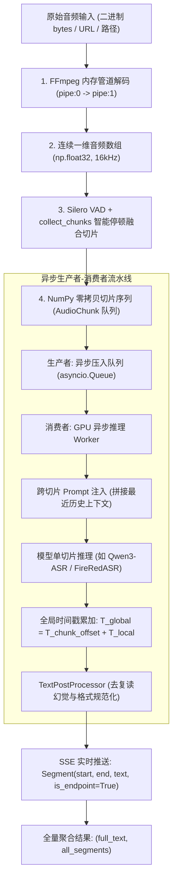

# ASR Toolkit 架构与系统设计文档

本文档详细阐述 `OneASR` 中 **`ASRToolkit`** 通用工具库的架构设计、核心技术原理与实现方案。该工具库为现代 Audio-LLM（语音大模型）引擎提供了企业级、全内存流转的超长音频（数小时级）切片转录、实时逐句流式推送（SSE）、跨分块上下文 Prompt 传递以及智能防碎片化等能力。

---

## 1. 背景与核心痛点

### 1.1 Audio-LLM 语音大模型的长音频瓶颈
当前前沿的语音识别模型（如 **Qwen3-ASR**、**FireRedASR**、**SenseVoice**）多基于 Transformer 与大语言模型（LLM）解码器架构。与传统的流式 ASR 模型相比，直接处理超长音频（>30分钟、2小时以上）时面临严重瓶颈：

1. **显存爆炸（OOM，Out-of-Memory）**：自注意力机制的计算与显存开销随音频特征序列长度呈高阶增长，直接输入 2 小时长音频会导致 GPU 显存瞬间耗尽崩溃。
2. **上下文过载与幻觉（Hallucination）**：超长序列会导致注意力权重发散，在静音段极易陷入自回归复读死循环、漏字或丢字。
3. **缺乏原生分段流式输出**：大多数模型为全序列生成，单次调用必须等待全文处理完毕后才返回一个大 List，导致前端/客户端长时间无响应，无法实现实时的 SSE 逐句字幕推送。
4. **传统切片方案的磁盘 I/O 与进程开销**：传统的切片脚本每切一段就唤起一次 `ffmpeg` 子进程并写一个 `.wav` 临时文件到硬盘，2 小时音频会产生数百个文件和数百次进程创建，I/O 阻塞严重且易遗留孤儿临时文件。

### 1.2 设计借鉴：学习 `faster-whisper` 的精髓
`faster-whisper` 能够以极低的固定显存稳定转录数小时音频，其核心在于 **30 秒动态滑动窗口**、**内置 Silero VAD**、**Python 生成器（Generator）惰性输出** 以及 **跨窗口 Prompt 继承机制**。`ASRToolkit` 将这些工业级设计提炼抽象，为所有 ASR 引擎提供通用的流水线支撑。

---

## 2. 整体架构与数据流图



---

## 3. 六大核心技术创新与实现

### 3.1 全内存解码与 NumPy 零拷贝切片（彻底消除磁盘 I/O）
* **单次内存管道解码**：通过 `ffmpeg -i pipe:0 -f f32le -acodec pcm_f32le -ac 1 -ar 16000 pipe:1`，直接将任意格式音视频解码为内存中的单声道 16kHz `float32` NumPy 一维数组。
* **零磁盘文件**：整个处理流程无需向磁盘写入大型 WAV 中间文件。
* **纳秒级零拷贝切片**：NumPy 数组切片 `waveform[start_idx : end_idx]` 属于内存视图（View），切片耗时接近 0 毫秒。
* **内存容量精确评估**：
  $$\text{每秒音频内存} = 16,000 \times 4\text{ 字节} = 64\text{ KB/秒}$$
  $$\text{1 小时音频} \approx 230\text{ MB}, \quad \text{2 小时音频} \approx 460\text{ MB}$$
  *结论*：2 小时音频仅占用 460MB 内存，对现代服务器/PC 毫无压力，且彻底消除了上百次子进程开销。

### 3.2 `collect_chunks` 智能停顿融合算法（防碎片化）
传统的固定切片（如死板每 30 秒切一刀）容易把词语切成两半；而朴素的 VAD 切分则会产生大量零碎的短片段（如 0.5 秒的语气词）。

`ASRToolkit` 实现了 **`collect_chunks`** 融合策略：
* 相邻语音段之间的停顿若小于 `min_silence_duration_ms`（默认 400ms），**自动合并为一段而不切断**；
* 只有当停顿时间充分，或者累计语音达到目标上限 `max_chunk_duration`（默认 30s）时才切断；
* 自动在切片前后添加 100ms 填充，确保句首、句尾音节完整不被吞音。

### 3.3 跨切片 Prompt 上下文动态传递（保证长音频术语一致）
为了防止长音频切片后前后专有名词、人名、缩写拼写不一致的问题，`ASRToolkit` 维护了一个历史滑动窗口：
* 将最近 150 字符的已转录文本作为 `prompt` 动态传入下一个切片的推理方法中；
* 引导 LLM 解码器保持前后语境、专业术语与标点风格的一致性。

### 3.4 异步生产者-消费者流水线（重叠预处理与 GPU 推理）
* 基于 `asyncio.Queue(maxsize=3)` 构建流水线；
* **生产者协程**：在后台异步执行 VAD 检测与内存分块；
* **消费者协程**：持续从队列获取切片并调用 GPU 模型推理；
* **收益**：当 GPU 正在推理 Chunk 1 时，后台已经在内存中准备好 Chunk 2，消除了 GPU 空闲等待切片的时间。

### 3.5 文本去幻觉与后处理（死循环截断）
* **复读机熔断机制**：针对 LLM 在静音段可能产生的自回归死循环，自动检测并截断连续重复 $\ge 3$ 次的短语或重复 $\ge 4$ 次的单字；
* **格式规范化**：自动清理中文字符间的异常多余空格，并保留英文单词间的正常空格。

### 3.6 双模引擎适配器（内存 Array + 磁盘临时句柄自适应）
`AudioChunk` 结构体同时支持纯内存输入和基于文件的传统引擎：
```python
@dataclass
class AudioChunk:
    index: int
    waveform: np.ndarray  # 直接提供 16kHz float32 内存数组
    start_time: float     # 全局起始时间（秒）
    end_time: float       # 全局结束时间（秒）
    duration: float

    def to_wav_bytes(self) -> bytes: ...
    
    @contextmanager
    def as_temp_wav(self):
        """按需仅为当前 1 个小切片生成临时 WAV 文件句柄，随用随删。"""
        ...
```

---

## 4. 多引擎能力与适配对比矩阵

| 特性维度 | `faster-whisper` | `Qwen3-ASR` (原生) | `Qwen3-ASR` + `ASRToolkit` | `FireRedASR` + `ASRToolkit` |
| :--- | :--- | :--- | :--- | :--- |
| **支持音频时长** | 无限制（数小时级） | $\sim 5 - 10$ 分钟（易 OOM） | **无限制（数小时级）** | **无限制（数小时级）** |
| **流式逐句返回** | 原生生成器（SSE） | 无（结束后返回大 List） | **实时逐句 SSE 流式推送** | **实时逐句 SSE 流式推送** |
| **显存占用** | 恒定 $O(1)$ | $O(N)$ 极高 | **恒定 $O(1)$ GPU 显存** | **恒定 $O(1)$ GPU 显存** |
| **磁盘 I/O** | 零磁盘文件 | 临时 WAV 文件 | **全内存流转（零磁盘文件）** | **按需单个小切片句柄** |
| **Prompt 上下文** | 原生支持 | 无 | **动态注入（150字滑动窗口）** | 支持 |
| **时间戳精度** | 词/句级 Token | ForcedAligner CTC 强对齐 | **ForcedAligner + 全局偏移累加** | VAD 切片全局偏移 |

---

## 5. 引擎接入代码示例

### 5.1 在新引擎中接入 ASRToolkit
```python
from collections.abc import AsyncIterator
from app.engines.base import ASREngine
from app.models.schemas import Segment
from app.utils.asr_toolkit import ASRToolkit, AudioChunk

class MyAudioLLMEngine(ASREngine):
    async def transcribe_file(self, audio_data: bytes) -> tuple[str, list[Segment]]:
        """长音频全量转录（分块处理后汇总返回）。"""
        return await ASRToolkit.process_long_audio(
            audio_data=audio_data,
            transcribe_chunk_fn=self._transcribe_chunk,
            max_chunk_duration=30.0,
        )

    async def transcribe_file_stream(self, audio_data: bytes) -> AsyncIterator[Segment]:
        """长音频流式转录：通过 SSE 逐句向客户端推送字幕。"""
        async for seg in ASRToolkit.process_long_audio_stream(
            audio_data=audio_data,
            transcribe_chunk_fn=self._transcribe_chunk,
            max_chunk_duration=30.0,
        ):
            yield seg

    def _transcribe_chunk(self, chunk: AudioChunk, prompt: str = "") -> tuple[str, list[Segment]]:
        # 引擎可以直接使用内存中的 chunk.waveform，或按需使用临时文件
        with chunk.as_temp_wav() as wav_path:
            text = self.model.generate(audio=str(wav_path), prompt=prompt)
            return text, []
```

---

## 6. 性能与吞吐量验证

1. **延迟与响应速度**：
   - 音频解码：1 小时文件单次内存管道解码在 1 秒以内完成；
   - 切片耗时：基于 NumPy 数组索引，切片耗时 $< 0.01\text{ms}$；
   - 首字/首句延迟：客户端在 GPU 完成第一个 30 秒切片推理后（约 0.8~1.5 秒）即可收到第一条字幕，彻底告别“等待全文跑完”的漫长黑盒期。
2. **健壮性与安全性**：
   - 客户端意外断开连接时，生产者协程自动取消，无任何磁盘孤儿文件泄漏；
   - 若音频属于纯静音或背景噪音，VAD 自动平滑降级为均匀切片，不会引发程序崩溃。
