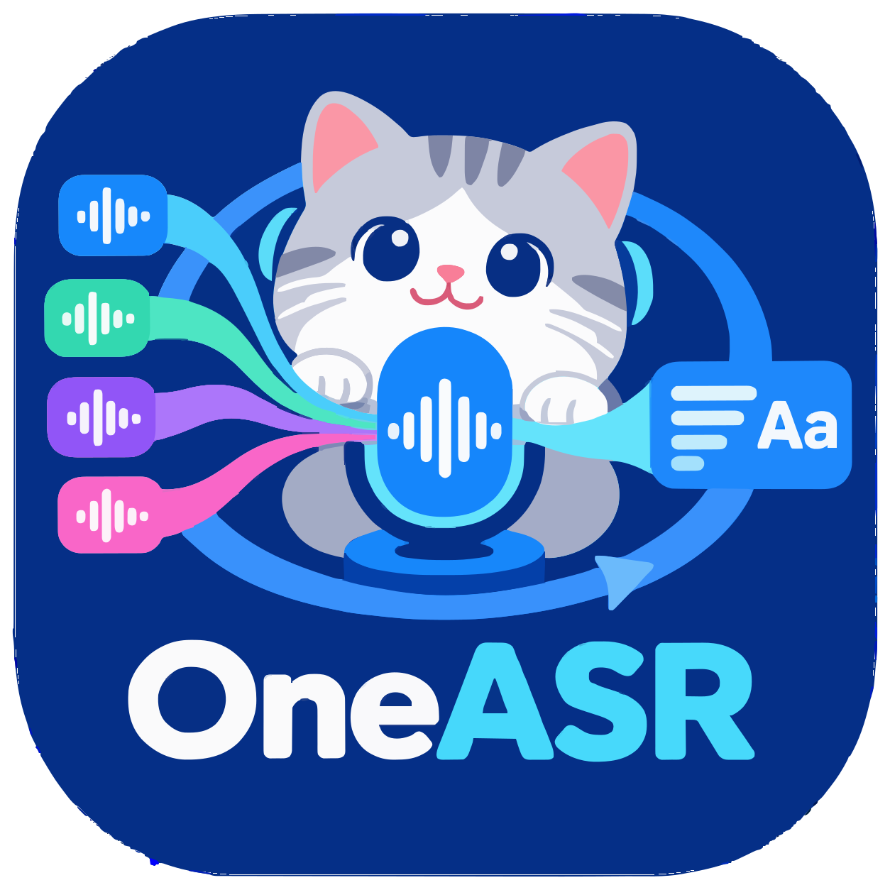

# OneASR

<p align="center">
  
</p>

整合多种 ASR 引擎，对外提供统一的语音识别 API。

## 功能

- **文件识别** — 上传音视频文件或传入 URL，返回完整识别结果
- **流式文件识别** — 上传音视频文件或传入 URL，以 SSE 逐句返回识别结果
- **流式识别** — 通过 WebSocket 传输音频流，实时返回识别结果
- **文件上传与秒传** — 上传文件时携带 MD5 指纹，相同文件自动秒传
- **Web 管理界面** — Vue.js 前端，支持文件/URL 识别、实时流式结果展示、SRT 导出

## 快速开始

### 环境要求

- Python 3.11+
- Node.js 18+
- FFmpeg（音频处理必需）

### 后端启动

```bash
# 1. 创建并激活虚拟环境
python3 -m venv .venv
source .venv/bin/activate  # macOS/Linux
# 或：.venv\Scripts\activate  # Windows

# 2. 安装依赖
pip install -r requirements.txt

# 3. 启动服务
uvicorn server.main:app --host 0.0.0.0 --port 8020
```

服务运行在 `http://localhost:8020`，访问 `http://localhost:8020/docs` 查看交互式 API 文档。

### 前端启动

```bash
# 1. 进入 web 目录
cd web

# 2. 安装依赖
npm install

# 3. 启动开发服务器
npm run dev
```

前端运行在 `http://localhost:3020`，自动代理 API 请求到后端。

### 一键启动（两个终端）

**终端 1 - 后端：**
```bash
cd OneASR
source .venv/bin/activate
uvicorn server.main:app --host 0.0.0.0 --port 8020
```

**终端 2 - 前端：**
```bash
cd OneASR/web
npm run dev
```

### 验证安装

```bash
# 检查后端健康状态
curl http://localhost:8020/health

# 列出可用引擎
curl -H "X-API-Key: oneasr-key" http://localhost:8020/api/v1/engines
```

启动后访问：
- 前端界面：`http://localhost:3020`
- API 文档：`http://localhost:8020/docs`
- 健康检查：`http://localhost:8020/health`

### 媒体截取工具

项目提供了媒体截取工具，用于将长视频分割成短片段：

```bash
# 截取指定时长（默认 2 分钟）
python cli/clip.py input_video.mp4 120

# 自动将整个视频截取成 2 分钟片段
python cli/clip.py input_video.mp4
```

Python API 使用：
```python
from cli.clip import MediaClipper

clipper = MediaClipper("video.mp4")
clipper.clip(start=0, duration=120, output="clip.mp4")
clips = clipper.auto_clip(clip_duration=120, output_dir="clips/")
```

## 模型下载指南 (Hugging Face / ModelScope)

OneASR 支持多种本地 ASR 引擎（如 Qwen3-ASR、Faster-Whisper、FireRedASR 等）。模型默认存放于 `OneASR/models/` 目录。你可以通过 **Hugging Face CLI** 或 **ModelScope (魔搭社区)** 下载模型权重。

### 1. 安装下载工具

根据你的网络环境选择合适的下载工具：

```bash
# 方式 A：安装 Hugging Face CLI (提供 hf 命令行工具)
pip install -U "huggingface_hub[cli]"

# 国内网络加速（可选，配置 Hugging Face 镜像源）
export HF_ENDPOINT=https://hf-mirror.com

# 方式 B：安装 ModelScope CLI（国内环境推荐）
pip install -U modelscope
```

### 2. 常用模型下载命令

> **注意**：请在 `OneASR/` 根目录下执行以下命令，模型文件将直接下载到 `models/` 对应子目录中。

#### ① Qwen3-ASR（语音识别主模型）
*推荐版本：`Qwen/Qwen3-ASR-1.7B`（高质量）或 `Qwen/Qwen3-ASR-0.6B`（轻量）*

- **Hugging Face (`hf`)**:
  ```bash
  hf download Qwen/Qwen3-ASR-1.7B --local-dir models/Qwen3-ASR-1.7B
  ```
- **ModelScope CLI**:
  ```bash
  modelscope download --model Qwen/Qwen3-ASR-1.7B --local_dir models/Qwen3-ASR-1.7B
  ```

#### ② Qwen3-ForcedAligner（时间戳对齐模型）
*用于生成精确字/词级时间戳：`Qwen/Qwen3-ForcedAligner-0.6B`*

- **Hugging Face (`hf`)**:
  ```bash
  hf download Qwen/Qwen3-ForcedAligner-0.6B --local-dir models/Qwen3-ForcedAligner-0.6B
  ```
- **ModelScope CLI**:
  ```bash
  modelscope download --model Qwen/Qwen3-ForcedAligner-0.6B --local_dir models/Qwen3-ForcedAligner-0.6B
  ```

#### ③ Faster-Whisper（Whisper 系列）
*常用模型：`Systran/faster-whisper-medium`、`Systran/faster-whisper-large-v3` 等*

- **Hugging Face (`hf`)**:
  ```bash
  hf download Systran/faster-whisper-medium --local-dir models/faster-whisper-medium
  ```
- **ModelScope CLI**:
  ```bash
  modelscope download --model Systran/faster-whisper-medium --local_dir models/faster-whisper-medium
  ```

#### ④ FireRedASR 系列模型
*常用模型：`FireRedTeam/FireRedASR-AED-L`、`FireRedTeam/FireRedASR-LLM-L`*

- **Hugging Face (`hf`)**:
  ```bash
  hf download FireRedTeam/FireRedASR-AED-L --local-dir models/FireRedASR-AED-L
  ```
- **ModelScope CLI**:
  ```bash
  modelscope download --model FireRedTeam/FireRedASR-AED-L --local_dir models/FireRedASR-AED-L
  ```

#### ⑤ X-ASR（流式实时识别模型，基于 sherpa-onnx）
*模型：[`GilgameshWind/X-ASR-zh-en`](https://huggingface.co/GilgameshWind/X-ASR-zh-en)（中英文流式识别，zipformer2 transducer）*

- **Hugging Face (`hf`)**:
  ```bash
  hf download GilgameshWind/X-ASR-zh-en \
    --include "deployment/models/chunk-160ms-model/*" \
    --local-dir models
  mv models/deployment/models/chunk-160ms-model models/chunk-160ms-model
  ```

- **ModelScope CLI**:
  ```bash
  modelscope download --model Gilgamesh-J/X-ASR-zh-en \
    --include "deployment/models/chunk-160ms-model/*" \
    --local_dir models
  mv models/deployment/models/chunk-160ms-model models/chunk-160ms-model
  ```

### 3. Python 脚本批量下载 (可选)

如果你希望一次性自动下载所需的所有模型，可运行以下 Python 脚本：

```python
# download_models.py
from modelscope import snapshot_download

# 定义需要下载的模型映射表: local_dir -> model_id
MODELS = {
    "models/Qwen3-ASR-1.7B": "Qwen/Qwen3-ASR-1.7B",
    "models/Qwen3-ForcedAligner-0.6B": "Qwen/Qwen3-ForcedAligner-0.6B",
    "models/faster-whisper-medium": "Systran/faster-whisper-medium",
}

for local_path, model_id in MODELS.items():
    print(f"正在从 ModelScope 下载 {model_id} 到 {local_path} ...")
    snapshot_download(model_id, local_dir=local_path)
print("所有模型下载完成！")
```

### 4. 在 `config.yaml` 中配置并启用模型

模型下载完成后，编辑 `config.yaml` 确保对应 Provider 的 `model_path` 指向下载目录：

```yaml
ASR-Providers:
  # Qwen3-ASR 配置示例
  qwen:
    enable: true
    engine: qwen
    load:
      model_name: Qwen/Qwen3-ASR-1.7B
      model_path: models/Qwen3-ASR-1.7B
      device: cpu  # 支持 cpu / cuda:0 / mps
      dtype: float32
      max_new_tokens: 256
      max_inference_batch_size: 32
      # 可选启用 Forced Aligner 精确时间戳
      # forced_aligner_name: Qwen/Qwen3-ForcedAligner-0.6B
      # forced_aligner_path: models/Qwen3-ForcedAligner-0.6B

  # Faster-Whisper 配置示例
  faster-whisper:
    enable: false
    engine: faster-whisper
    load:
      model_name: medium
      model_path: models/faster-whisper-medium
      device: cpu
      compute_type: int8
```

## 认证

所有 API 接口（`/health` 除外）需要通过请求头 `X-API-Key` 传递 API Key。

API Key 在 `config.yaml` 中配置：

```yaml
api_key: oneasr-key
```

```bash
# 使用 API Key 调用接口
curl -H "X-API-Key: oneasr-key" http://localhost:8020/api/v1/engines

# 上传文件识别
curl -X POST -H "X-API-Key: oneasr-key" \
  http://localhost:8020/api/v1/transcribe/file \
  -F "file=@audio.mp3" -F "format=srt" -o subtitle.srt
```

WebSocket 流式接口通过查询参数传递（浏览器 WebSocket API 不支持自定义请求头）：`ws://localhost:8020/ws/transcribe/stream?api_key=oneasr-key`

## API 接口

### 统一 API（兼容 OpenAI 格式）

| 接口 | 方法 | 说明 |
|------|------|------|
| `/api/v1/audio/transcriptions` | POST | 创建转录（文件上传或 file_uuid） |
| `/api/v1/audio/transcriptions/stream` | POST | 创建流式转录（SSE） |
| `/api/v1/audio/models` | GET | 列出可用模型 |
| `/api/v1/files/upload` | POST | 上传文件（支持 MD5 秒传） |
| `/api/v1/files/list` | GET | 列出所有已上传文件 |
| `/api/v1/files/{file_id}` | GET | 获取文件信息 |
| `/api/v1/files/{file_id}` | DELETE | 删除已上传文件 |
| `/health` | GET | 健康检查 |

### WebSocket 流式

| 接口 | 方法 | 说明 |
|------|------|------|
| `/ws/transcribe/stream?api_key=` | WebSocket | 流式识别（基于 WhisperLiveKit） |

## 文件上传与秒传（MD5 去重）

上传文件时可携带 MD5 指纹，实现重复文件秒传：

```bash
# 首次上传：文件保存并写入数据库
curl -X POST -H "X-API-Key: oneasr-key" \
  "http://localhost:8020/api/v1/files/upload?file_md5=abc123&file_size=1024000" \
  -F "file=@audio.mp3"
# 响应: {"duplicate": false, "file_id": "uuid-1", ...}

# 重复文件秒传：直接返回已有 file_id（不重新上传）
curl -X POST -H "X-API-Key: oneasr-key" \
  "http://localhost:8020/api/v1/files/upload?file_md5=abc123&file_size=1024000" \
  -F "file=@audio_copy.mp3"
# 响应: {"duplicate": true, "file_id": "uuid-1", ...}
```

## 流式识别

基于 [WhisperLiveKit](https://github.com/QuentinFuxa/WhisperLiveKit) 实现的实时语音识别，支持：

- **VAD/VAC** — Silero 语音活动检测，自动识别语音/静音边界
- **SimulStreaming** — 低延迟流式策略（默认），或 LocalAgreement 高准确策略
- **时间戳对齐** — 每行文本附带精确的开始/结束时间
- **说话人分离** — 可选的说话人识别（需额外模型）
- **多语言** — 自动语言检测或指定语言

### WebSocket 连接

```javascript
const ws = new WebSocket("ws://localhost:8020/ws/transcribe/stream?api_key=oneasr-key&language=zh");

ws.onmessage = (event) => {
  const data = JSON.parse(event.data);
  if (data.type === "config") {
    console.log("连接配置:", data);
  } else if (data.type === "ready_to_stop") {
    console.log("识别完成");
  } else {
    console.log(data.lines);
  }
};

ws.send(audioChunk);
ws.send(new Uint8Array(0));
```

## 运行测试

```bash
# 运行所有测试
python -m pytest tests/ -v

# 只运行 API 接口测试（快速，无外部依赖）
python -m pytest tests/api/ -v

# 只运行通用/单元测试
python -m pytest tests/general/ -v

# 运行单个测试文件
python -m pytest tests/api/test_file_upload.py -v

# 跳过集成测试（需要真实音频文件和运行中的服务）
python -m pytest tests/ -m "not integration" -v

# 简短错误输出
python -m pytest tests/api/ -v --tb=short
```

### 测试目录结构

```
tests/
├── conftest.py                  # 共享 fixtures（client、数据库清理）
├── api/                         # API 接口测试（使用 TestClient）
│   ├── test_audio.py            # 音频转录 API
│   ├── test_file_upload.py      # 文件上传、MD5 秒传、CRUD
│   ├── test_models.py           # 模型列表、格式参数
│   └── test_streaming.py        # SSE 流式转录
└── general/                     # 单元测试 & 集成测试
    ├── test_format.py           # 输出格式转换（SRT/VTT/JSON/TSV）
    ├── test_engines.py          # 引擎加载与转录
    ├── test_mimo.py             # MiMo 音频理解引擎
    ├── test_stream_websocket.py # WebSocket 流式集成测试
    └── test_stream_whisperlivekit.py  # WhisperLiveKit 引擎测试
```

## 配置

编辑 `config.yaml` 配置 API Key 和引擎：

```yaml
# API Key（所有接口必须携带此 key）
api_key: oneasr-key

# 默认 Provider
default_provider: whisper1

# 模型根目录（取消注释并指定路径可强制使用本地模型）
# model_dir: ./models

# Provider 配置
providers:
  whisper1:
    engine: faster-whisper
    type: local
    model_name: medium
    device: cpu
    compute_type: int8
    max_duration: null

  mimo:
    engine: mimo
    type: cloud
    model_name: mimo-audio
    api_key:   # 小米 MiMo API Key
    base_url:

  whisperlivekit:
    type: local
    model_name: base
    device: cpu
    compute_type: int8
    backend: auto
    backend_policy: simulstreaming
    language: auto
    vac: true
    diarization: false
    pcm_input: true
```

## 文档导航

详细设计与使用指南请查阅 `docs/` 目录：

- **API 设计与参考**
  - [API 设计方案](docs/api/API_DESIGN.md) — 统一接口架构、分片与流式设计
  - [API 完整参考手册](docs/api/API_REFERENCE.md) — 端点请求参数、状态码与示例
- **架构与技术设计**
  - [项目架构设计](docs/architecture/project_design.md) — 系统分层、状态机与异步调度
  - [ASR 工具包设计](docs/architecture/ASR_TOOLKIT_DESIGN.md) — VAD、重采样与音频流分块
- **指南与规范**
  - [模型配置与部署指南](docs/guides/MODEL_GUIDE.md) — FireRedASR、SenseVoice、Whisper 等模型接入
  - [uv 包管理器指南](docs/guides/UV_GUIDE.md) — 高性能依赖安装与环境管理
  - [开发辅助规范](docs/guides/CLAUDE.md) — 开发与测试规范
- **第三方参考**
  - [yt-dlp 完整参考](docs/references/yt-dlp-README.md) — 网络媒体解析参考

---

## 项目结构

```
OneASR/
├── docs/                         # 项目设计与开发文档中心
│   ├── api/                      # API 设计与参考手册
│   ├── architecture/             # 架构与底层工具设计
│   ├── guides/                   # 模型部署与工具链指南
│   ├── references/               # 第三方参考资料
│   └── assets/                   # 图标与静态资源
├── app/                          # 后端应用核心
│   ├── main.py                   # FastAPI 入口与生命周期管理
│   ├── api/                      # 路由层（控制器）
│   │   ├── auth.py               # API Key 鉴权依赖
│   │   ├── audio.py              # OpenAI 兼容同步音频接口
│   │   ├── file_upload.py        # 文件上传/秒传与 URL 导入
│   │   ├── file_transcription.py # 大文件异步转录与 SSE 流式推送
│   │   ├── media.py              # 独立媒体解析与下载接口
│   │   ├── model.py              # 模型信息接口
│   │   ├── provider.py           # 服务提供商接口
│   │   ├── realtime.py           # WebSocket 实时听写
│   │   └── realtime_ext.py       # WebSocket 扩展听写
│   ├── core/                     # 核心配置、存储与错误定义
│   │   ├── config.py             # YAML 配置管理
│   │   ├── errors.py             # 统一异常定义
│   │   └── file_storage.py       # 文件存储工具
│   ├── db/                       # 数据库连接与会话
│   │   ├── base.py               # SQLAlchemy 声明基类
│   │   └── session.py            # 数据库引擎、会话工厂、初始化
│   ├── engines/                  # 各 ASR 引擎适配实现
│   │   ├── base.py               # 引擎抽象基类
│   │   ├── whisper_engine.py     # faster-whisper 实现
│   │   ├── firered_engine.py     # FireRedASR 实现
│   │   ├── qwen_engine.py        # Qwen ASR 实现
│   │   ├── xasr_engine.py        # Sherpa / SenseVoice 实现
│   │   ├── openai_engine.py      # OpenAI 兼容 API
│   │   ├── mimo_engine.py        # 小米 MiMo API
│   │   └── registry.py           # 引擎注册中心与工厂
│   ├── models/                   # SQLAlchemy ORM 数据模型
│   │   └── orm_models.py         # 数据库实体表映射
│   ├── schemas/                  # Pydantic 请求/响应数据校验模式 (DTO)
│   │   ├── audio.py              # 转录音频相关 Schema
│   │   ├── file.py               # 文件上传与资产管理 Schema
│   │   ├── media.py              # 媒体解析与任务 Schema
│   │   └── transcription.py      # 异步转录任务 Schema
│   ├── services/                 # 业务逻辑服务层
│   │   ├── file_service.py       # 文件转录任务业务
│   │   ├── media_service.py      # 媒体异步下载与状态机
│   │   └── record_service.py     # 转录历史记录
│   └── utils/                    # 音视频工具库
│       ├── audio.py              # 音频格式转换与时长探测
│       ├── asr_toolkit.py        # VAD 切分与流式分块
│       ├── audio_converter.py    # 重采样与声道转换
│       ├── download.py           # URL 下载工具
│       ├── format.py             # 输出格式转换（SRT/VTT/JSON/TSV）
│       ├── stream.py             # PCM 流式处理工具
│       ├── vad.py                # Silero VAD 封装
│       └── video_url.py          # yt-dlp 与直链解析
├── cli/                          # 命令行与测试工具
│   ├── clip.py                   # 媒体截取工具
│   ├── converter.py              # 音频转换器
│   └── stream_simulation_client.py # 流式客户端模拟测试
├── web/                          # Vue 3 前端管理后台
├── tests/                        # 自动化测试套件
├── models/                       # 本地模型权重存放目录
├── data/                         # SQLite 数据库（自动创建）
├── uploads/                      # 上传文件存储目录
├── download/                     # 媒体下载临时目录
├── config.yaml                   # 核心配置文件
└── requirements.txt              # 依赖清单
```

## 开源协议

本项目采用 [Apache 2.0](LICENSE) 开源协议。
